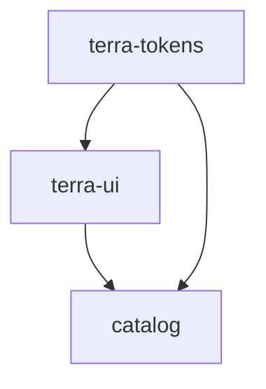

# Android Workspace Structure

Dokumen ini menjelaskan struktur code Android TERRA supaya developer bisa cepat paham:
- repo ini sebenarnya untuk apa
- folder mana isi apa
- file component harus ditaruh di mana
- relasi antar module seperti apa
- nanti cara consume library ini idealnya bagaimana

Dokumen ini fokus ke **struktur source code dan workspace**, bukan ke parity audit komponen.

---

## 1. Tujuan workspace Android ini

Workspace `android/` dipakai sebagai:

1. **source of truth** untuk design system Android berbasis XML/View
2. **reusable library source** yang bisa dipakai developer Android
3. **preview/demo area** untuk melihat component secara visual
4. **validation layer** agar resource XML, Kotlin, dan dependency antar module bisa dicek

Artinya, tujuan folder ini bukan hanya menyimpan file XML/Kotlin secara terpisah, tapi menjadi fondasi library Android yang:
- rapi
- reusable
- mudah di-validate
- mudah dipahami developer

---

## 2. Prinsip utama struktur

Prinsip struktur workspace ini:

- **source-first** → semua file library disimpan sebagai source yang jelas
- **buildable** → idealnya tetap bisa di-compile
- **modular** → tokens, UI library, dan catalog dipisah
- **predictable** → setiap developer tahu component harus diletakkan di mana
- **scalable** → mudah tambah component baru tanpa merusak struktur lama

---

## 3. Struktur workspace tingkat atas

Struktur ideal di dalam `android/` adalah:

```text
android/
  settings.gradle.kts
  build.gradle.kts
  gradle.properties
  gradlew
  gradlew.bat

  terra-tokens/
  terra-ui/
  catalog/

  README.md
  ANDROID_WORKSPACE_STRUCTURE.md
  WEB_TO_ANDROID_GAP_AUDIT.md
  WEB_TO_ANDROID_ROADMAP.md
  WEB_TO_ANDROID_TRACKER.md
```

### Penjelasan
- `terra-tokens/` → module resource dasar
- `terra-ui/` → module reusable design system component
- `catalog/` → sample/demo app
- file `.md` di root `android/` → dokumentasi kerja dan dokumentasi arsitektur

---

## 4. Peran tiap module

## A. `terra-tokens`
Module ini berisi **foundation resources**.

### Isi utama
- color tokens
- spacing tokens
- radius tokens
- elevation tokens
- typography/token resource lain

### Fungsi
- menjadi dependency dasar untuk `terra-ui`
- memastikan semua component memakai token yang konsisten
- menghindari hardcode style berulang di setiap component

### Contoh isi
```text
android/terra-tokens/
  src/main/res/values/
    terra_colors_primitives.xml
    terra_dimens_spacing.xml
    terra_dimens_radius.xml
    terra_component_dimens.xml
```

### Rule
- token dasar taruh di `terra-tokens`
- jangan taruh component-specific attrs di sini
- jangan taruh demo/sample di sini

---

## B. `terra-ui`
Module ini adalah **library utama** yang dipakai developer.

### Isi utama
- reusable custom views berbasis XML/View
- attrs XML per component
- internal layout XML component
- styles/drawables yang dipakai component

### Fungsi
- menjadi package reusable untuk aplikasi Android lain
- menjadi tempat implementasi komponen design system

### Struktur ideal
```text
android/terra-ui/
  src/main/java/com/terra/ds/
    button/
      TerraButtonView.kt
    card/
      TerraCardView.kt
    header/
      TerraHeaderView.kt
    icon/
      TerraIconView.kt
    ...

  src/main/res/
    layout/
      terra_view_card.xml
      terra_view_header.xml
      ...

    drawable/
      terra_bg_card.xml
      terra_bg_button_primary.xml
      ...

    values/
      attrs_button.xml
      attrs_card.xml
      attrs_header.xml
      ...
      styles_button.xml
      styles_card.xml
      styles_header.xml
      ...
```

### Rule
- 1 component = 1 package Kotlin
- 1 component = 1 file attrs bila perlu
- 1 component = 1 internal layout bila anatomy-nya kompleks
- style component dipisah agar mudah dirawat
- resource prefix tetap konsisten: `terra_`

---

## C. `catalog`
Module ini adalah **sample/demo application**.

### Isi utama
- screen preview component
- sample XML penggunaan component
- tempat QA visual dasar

### Fungsi
- memudahkan designer/dev cek hasil implementasi
- memvalidasi component secara visual
- menjadi contoh cara pakai untuk developer

### Struktur ideal
```text
android/catalog/
  src/main/res/layout/
    terra_catalog_buttons.xml
    terra_catalog_card.xml
    terra_catalog_header_icon.xml
    terra_catalog_feedback_selection.xml
    terra_catalog_forms_overlay.xml
```

### Rule
- `catalog` tidak boleh jadi tempat reusable component logic utama
- semua reusable logic harus tetap tinggal di `terra-ui`
- `catalog` hanya untuk demo, preview, dan sample penggunaan

---

## 5. Relasi antar module

Relasi idealnya seperti ini:



### Penjelasan
- `terra-ui` bergantung pada `terra-tokens`
- `catalog` bergantung pada `terra-ui`
- `catalog` juga bisa langsung memakai token bila perlu background/layout demo

---

## 6. Aturan penempatan file component

Kalau menambah component baru, struktur yang dipakai harus konsisten.

Contoh untuk `Card`:

### Kotlin
```text
android/terra-ui/src/main/java/com/terra/ds/card/TerraCardView.kt
```

### Attrs
```text
android/terra-ui/src/main/res/values/attrs_card.xml
```

### Internal layout
```text
android/terra-ui/src/main/res/layout/terra_view_card.xml
```

### Styles
```text
android/terra-ui/src/main/res/values/styles_card.xml
```

### Drawable pendukung
```text
android/terra-ui/src/main/res/drawable/terra_bg_card.xml
```

### Catalog demo
```text
android/catalog/src/main/res/layout/terra_catalog_card.xml
```

### Rule umum
Untuk setiap component baru, pikirkan file-nya dalam 2 layer:

#### Layer 1 — Reusable library
Masuk ke `terra-ui`
- Kotlin custom view
- attrs
- internal layout
- style
- drawable

#### Layer 2 — Preview/demo
Masuk ke `catalog`
- sample XML
- sample state/variant

---

## 7. Naming convention

Supaya struktur mudah dibaca, gunakan aturan nama berikut.

## Kotlin class
- `TerraButtonView`
- `TerraCardView`
- `TerraHeaderView`

## Kotlin package
- `com.terra.ds.button`
- `com.terra.ds.card`
- `com.terra.ds.header`

## Layout internal reusable
- `terra_view_button.xml`
- `terra_view_card.xml`
- `terra_view_header.xml`

## Catalog demo layout
- `terra_catalog_buttons.xml`
- `terra_catalog_card.xml`
- `terra_catalog_header_icon.xml`

## Attr files
- `attrs_button.xml`
- `attrs_card.xml`
- `attrs_header.xml`

## Style files
- `styles_button.xml`
- `styles_card.xml`
- `styles_header.xml`

## Drawable files
- `terra_bg_card.xml`
- `terra_bg_button_primary.xml`

### Naming goal
- dari nama file saja developer sudah bisa tahu ini file untuk apa
- reusable resource dan catalog resource tidak tercampur

---

## 8. Batas tanggung jawab tiap layer

## `terra-tokens`
Bertanggung jawab untuk:
- token foundational
- shared values

Tidak bertanggung jawab untuk:
- component logic
- attrs component
- catalog demo

## `terra-ui`
Bertanggung jawab untuk:
- reusable component
- XML attrs
- internal view structure
- component-specific style/drawable

Tidak bertanggung jawab untuk:
- screen app production
- business flow
- catalog navigation logic kompleks

## `catalog`
Bertanggung jawab untuk:
- demo tampilan
- sample usage
- visual preview

Tidak bertanggung jawab untuk:
- reusable component implementation utama
- token foundation ownership

---

## 9. Flow kerja saat menambah component baru

Urutan kerja yang ideal:

1. tentukan mapping Web → Android
2. buat package component di `terra-ui`
3. buat attrs XML component
4. buat internal layout XML bila perlu
5. buat style/drawable pendukung
6. buat catalog demo
7. update audit/tracker/docs
8. jalankan validation/build bila workspace sudah siap

---

## 10. Cara developer membaca workspace ini

Kalau developer baru masuk ke repo, cara membaca strukturnya sebaiknya begini:

### Kalau mau cari token dasar
Lihat:
- `android/terra-tokens/src/main/res/values/*`

### Kalau mau cari reusable component
Lihat:
- `android/terra-ui/src/main/java/com/terra/ds/*`
- `android/terra-ui/src/main/res/layout/*`
- `android/terra-ui/src/main/res/values/attrs_*.xml`

### Kalau mau lihat contoh pemakaian
Lihat:
- `android/catalog/src/main/res/layout/*`

### Kalau mau lihat status parity dan prioritas kerja
Lihat:
- `android/WEB_TO_ANDROID_GAP_AUDIT.md`
- `android/WEB_TO_ANDROID_TRACKER.md`
- `android/WEB_TO_ANDROID_ROADMAP.md`

---

## 11. Cara consume library ini ke depannya

Tujuan jangka panjang sebaiknya ada dua mode konsumsi:

## Mode A — local source integration
Developer memakai source module secara langsung di local workspace.

Cocok untuk:
- development internal
- iterasi cepat
- debugging component source

## Mode B — published library
Developer memakai artifact library yang sudah dipublish.

Contoh target jangka panjang:
- `terra-tokens` dipublish sebagai library
- `terra-ui` dipublish sebagai library
- aplikasi Android cukup `implementation(...)`

### Prinsip penting
Meskipun source repo ini adalah **source of truth**, strukturnya tetap harus disusun seolah-olah:
- bisa di-build
- bisa di-preview
- bisa di-publish

Itu yang bikin source file ini benar-benar siap dipakai developer.

---

## 12. Struktur minimum yang wajib dijaga tetap rapi

Minimal hal-hal ini harus selalu konsisten:

- package component terpisah per component
- attrs dipisah per component
- internal layout reusable dipisah dari catalog layout
- token foundation dipisah dari UI library
- nama resource pakai prefix `terra_`
- reusable logic tidak ditaruh di `catalog`

---

## 13. Recommended next step

Setelah dokumen struktur ini, langkah berikut yang ideal adalah:

1. scaffold Gradle workspace minimal untuk `android/`
2. tambahkan README cara build local
3. tambahkan README cara consume `terra-ui`
4. baru setelah itu lakukan build validation nyata

---

## 14. Kesimpulan

Kalau diringkas, struktur Android TERRA yang ideal adalah:

- `terra-tokens` = foundation
- `terra-ui` = reusable component library
- `catalog` = preview/demo app

Dan semua itu harus disusun dengan prinsip:

- mudah dibaca developer
- mudah di-maintain
- mudah di-validate
- siap dipakai sebagai source library

Jadi repo ini bukan sekadar tempat naruh file XML/Kotlin, tapi fondasi library Android yang rapi dan scalable.
